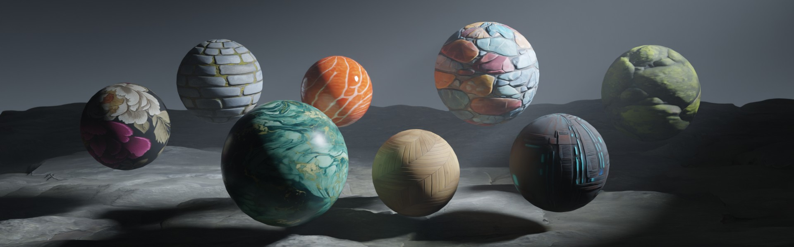

<div align="center">
<h1>Chord: Chain of Rendering Decomposition for PBR Material Estimation from Generated Texture Images</h1>

<a href="https://arxiv.org/abs/2509.09952"></a>
<a href="https://ubisoft-laforge.github.io/world/chord/"></a>
<a href="https://huggingface.co/spaces/Ubisoft/ubisoft-laforge-chord"></a>

[Zhi Ying](https://orcid.org/0009-0008-8390-3366)\*, [Boxiang Rong](https://ribosome-rbx.github.io/)\*, [Jingyu Wang](https://ccetaw.github.io/), [Maoyuan Xu](https://ultraman-blazar.github.io/)


</div>

Official implementation of the paper "**Chord: Chain of Rendering Decomposition for PBR Material Estimation from Generated Texture Images**".

## Setup environment

1. Clone github repo:
    ```shell
    git clone https://github.com/ubisoft/ubisoft-laforge-chord
    cd ubisoft-laforge-chord
    ```

2. Install dependencies. The example below uses [uv](https://docs.astral.sh/uv/getting-started/) to manage the virtual environment:

    ```shell
    # Get Python environment
    uv venv --python 3.12

    # On Linux/WSL
    source .venv/bin/activate

    # Or on Windows
    .venv\Scripts\activate

    # If you encounter the following error on Windows:
    # File .venv\Scripts\activate.ps1 cannot be loaded because running scripts is disabled on this system
    # Run the command: Set-ExecutionPolicy -Scope Process -ExecutionPolicy Bypass

    # Install dependencies
    uv pip install torch torchvision --index-url https://download.pytorch.org/whl/cu128
    uv pip install -r requirements.txt
    ```

3. Agree to the model's term from [here](https://huggingface.co/Ubisoft/ubisoft-laforge-chord), then log in:

    ```
    huggingface-cli login
    ```

4. (Optional) Install Gradio for running demo locally:

    ```
    uv pip install gradio
    ```

## Usage example

Run test:

```shell
python test.py --input-dir examples
```

Run the Gradio demo locally:

```shell
python demo_gradio.py
```

## License

This project is released under the **Ubisoft Machine Learning License (Research-Only - Copyleft)**. See the full terms in the [LICENSE](LICENSE) file
## Citation

If you find our work useful, please consider citing:

```
@misc{ying2025chord,
    title={Chord: Chain of Rendering Decomposition for PBR Material Estimation from Generated Texture Images}, 
    author={Zhi Ying and Boxiang Rong and Jingyu Wang and Maoyuan Xu},
    year={2025},
    eprint={2509.09952},
    archivePrefix={arXiv},
    primaryClass={cs.GR},
    url={https://arxiv.org/abs/2509.09952}, 
}
```

© [2025] Ubisoft Entertainment. All Rights Reserved.